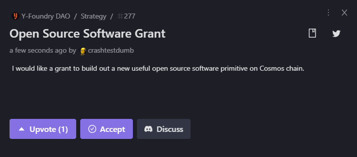
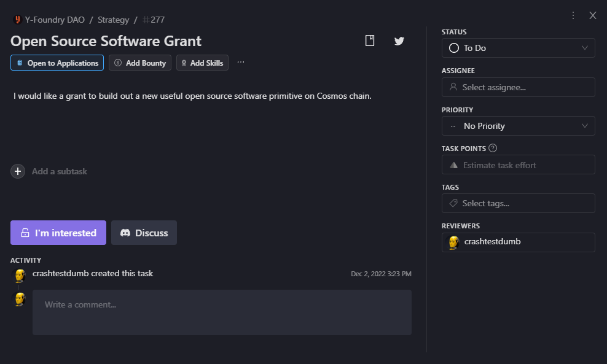
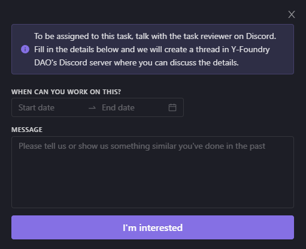

# 💡Strategy Development

A proposer with a vault idea gets connected to the Y-Foundry DAO community to receive guidance on developing the proposal. 

The Y-Foundry platform is flexible enough to accommodate a broad range of initiatives. Although each idea may be unique, the process to get started is the same. 

The proposer
- Develops the prospectus with the assistance of the Y-Foundry DAO community
- Gets connected with whitelisted developers ready to build the project

{: .important }
> This part of the process is _Off-chain for MVP_
>
> Y-Foundry DAO utilizes a variety of tools including Dework, Github, and Discord to organize discussions and provide support for proposals.

## Pre-proposal

* Submit a Community Suggestion in the Y-Foundry DAO Dework site. 
    * Go to [https://app.dework.xyz/y-foundry-dao/suggestions](https://app.dework.xyz/y-foundry-dao/suggestions)
	* Click on the **Add a suggestion** button  
	
	* Click on the **Discuss** button to join the conversation about your vault idea in the Discord strategy channel

* Work with the Y-Foundry DAO community to prepare and refine a Vault Prospectus

* Once the Prospectus has been finalized, it will be posted in Dework as a task.

* Interested whitelisted developers will submit bids on the task by clicking **I'm interested** in Dework.

* Developers fill in the details:

	* The start date and end date for development.
	* Link to their Statement of Work detailing their development costs and any other considerations.

* A specific thread is created in Discord where the developer can communicate with the proposer and community contributors.

* A bid is accepted and the developer is confirmed.

