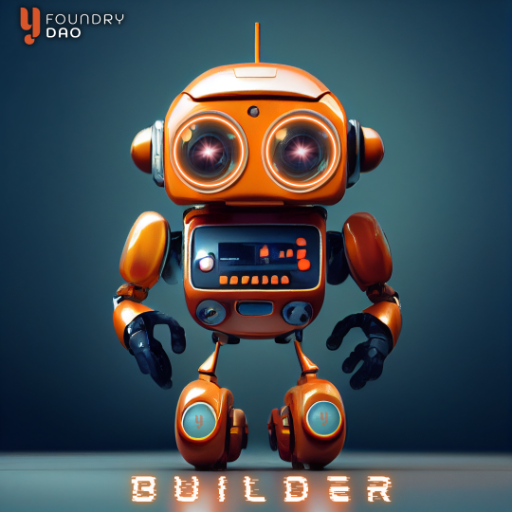
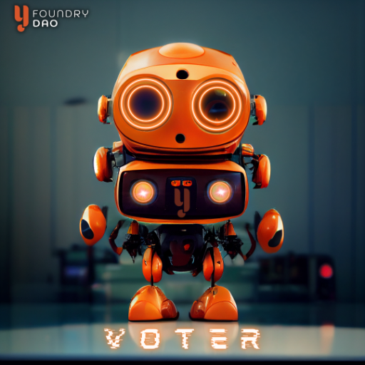

Roles
=====

***

Y-Foundry DAO is the governing community supporting the Y-Foundry ecosystem. Participants of the platform have the opportunity to obtain specialized roles. 

Roles play an important part in the successful operation of Y-Foundry. Each role has specific requirements to obtain, responsibilities to manage, and benefits to unlock for the participant.

{: .note}
> Roles are not mutually exclusive. A single individual can have multiple roles as long as the requirements are met for each.

***

## Y-Foundry Bots

|:-------|:--------|
|  |  |
|  |  |