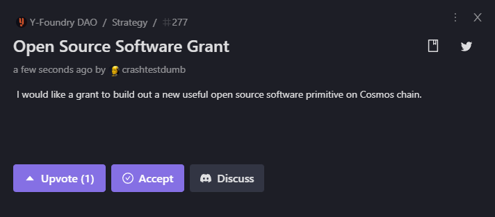
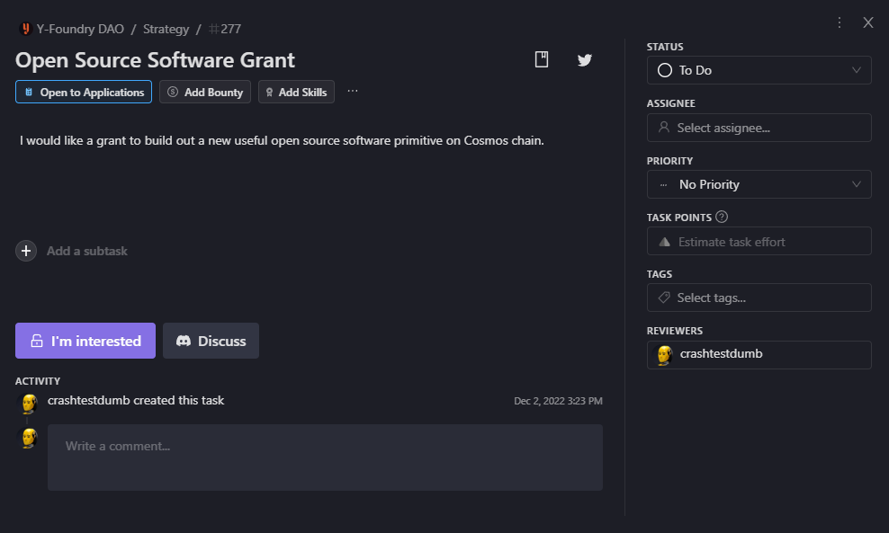
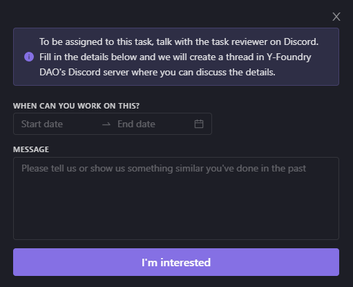

# 💡 Vault Development

***

A proposer with a vault idea connects to the Y-Foundry DAO community to receive guidance on developing the proposal. A proposal is a detailed plan for the vault. It clearly includes the what, how, who, and when information needed to launch the project successfully.

 

{: .note}
> The Y-Foundry platform is flexible enough to accommodate a broad range of initiatives. Although each idea may be unique, the process to get started is the same. 

 

The proposer gets connected with potential supporters of the vault including whitelisted developers ready to build the project.

 

{: .important }
> This part of the process is _Off-chain for MVP_
>
> Y-Foundry DAO utilizes a variety of tools including Dework, Github, and Discord to organize discussions and provide support for proposals.

 

Once the idea has been refined and all the details have been identified, the proposal is ready to be submitted officially on the Y-Foundry platform.

 

***

## Getting started with a vault idea

* Submit a Community Suggestion in the Y-Foundry DAO Dework site. 
    * Go to [https://app.dework.xyz/y-foundry-dao/suggestions](https://app.dework.xyz/y-foundry-dao/suggestions)
	* Click on the **Add a suggestion** button  
	
	* Click on the **Discuss** button to join the conversation about your vault idea in the Discord strategy channel

* Work with the Y-Foundry DAO community to prepare and refine a Vault Prospectus

* Once the Prospectus has been finalized, it will be posted in Dework as a task.

* Interested whitelisted developers will submit bids on the task by clicking **I'm interested** in Dework.

* Developers fill in the details:

	* The start date and end date for development.
	* Link to their Statement of Work detailing their development costs and any other considerations.

* A specific thread is created in Discord where the developer can communicate with the proposer and community contributors.

* A bid is accepted and the developer is confirmed.

