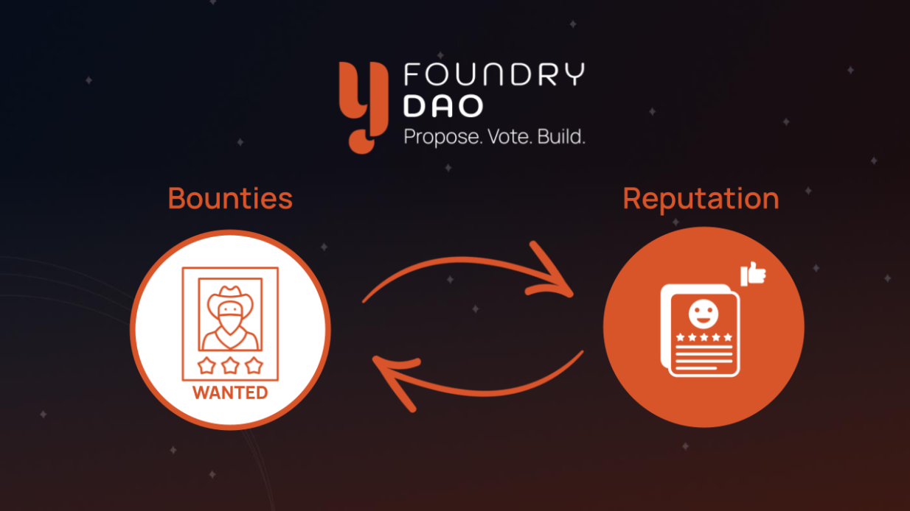

Y-Foundry
=========

Y-Foundry is a platform connecting community with creators to propose, vote, and build their ideas.

**Developed by the community.**

**Owned by the community.**

### What YFD does

The DAO structure supports in-depth community involvement and a culture of inclusivity. Y-Foundry encourages its entire community to get involved and contribute to the decision-making and development process of all projects under the Y-Foundry banner.

Y-Foundry DAO enables users to:

-   Launch vaults that automate DeFi strategies such as auto-compounding, arbitrage, or hedging.

-   Fund other users' vault ideas, claiming a portion of the fees earned.

-   Discover and complete interesting tasks, earn reputation, and build a Web3 portfolio.

-   Work for projects paid for by the community, with payments guaranteed by smart contracts.

### How YFD does it

With in-depth crypto knowledge and a deep understanding of Web3, the Y-Foundry DAO community leverages smart contracts and NFTs in novel ways, enabling:

-   Access to talented builders whitelisted by the community.

-   Secure mechanisms for project funding, and escrowed payment to developers based on milestones.

-   Auditable, trustless completion and deployment of smart contracts, without priveleged access.

-   A community with a vested long-term interest in the health of the project.