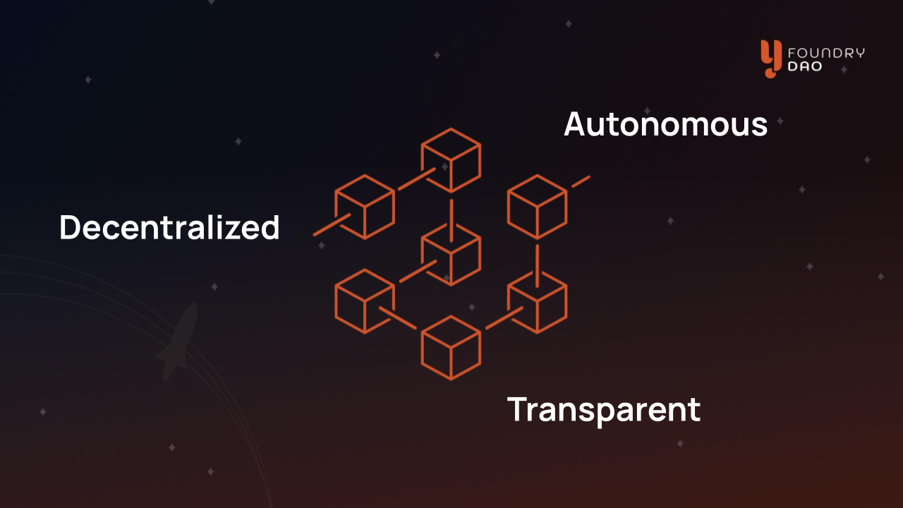

Y-Foundry
=========

Introducing Y-Foundry!

Y-Foundry is a platform connecting community with creators to propose, vote, and build their ideas.

**Developed by the community.**

**Owned by the community.**

Bringing an idea to market requires massive amounts of effort to coordinate developers, creators, and investment capital. Y-Foundry provides creators with the means to connect with the community and launch their projects. Anyone with a great idea can propose it to the Y-Foundry DAO, receive support to expand on their ideas, and find additional resources within the community. Y-Foundry enables creators and developers to connect, ideate, fund, and build the community-owned crypto projects of tomorrow.

### Coordination powered by Web3

Y-Foundry leverages blockchain technology to solve critical issues with online coordination.

**Accountability** - Smart contracts automate decisions and enable resources to be held until key milestones are met. For example, if a project does not deliver to the satisfaction of its supporters a vote can initiate the return of remaining funds. This holds creators accountable to their community of supporters. If they do not deliver on their promises they miss out on a large chunk of their funding.

**Decentralization** - Supporters are Boosters of projects on Y-Foundry. Boosters have a say in the direction of their projects through a novel implementation of NFTs. The Y-Foundry platform is itself governed by the Y-Foundry Decentralized Autonomous Organization owned by the participants of the ecosystem. Every participant has an equal opportunity to contribute and determine the direction of the platform.

**Security** - Project leads and builders using the platform are whitelisted by the community and verified on-chain providing an extra layer of transparency and prevention against fraud. Initiative funding provided by Boosters is securely held in escrow until needed with no co-mingling of funds or human interaction required. Only previously agreed-upon builders coded into the initiative's smart contracts are eligible for payments. Builders can trust that the funding is guaranteed as long as they deliver the work as agreed upon.

Y-Foundry connects the concepts of decentralized decision-making, on-chain automation, and DAO ownership to provide creators, builders, and the community with all the tools necessary to ensure a project's success.

### What can I do on Y-Foundry?

If you have an idea the Y-Foundry platform and community can help make it a reality.

- Launch initiatives like:
    - Automating DeFi strategies such as auto-compounding, arbitrage, or hedging
    - Releasing an NFT collection
    - Building a dApp
    - Funding a charitable idea
    - Starting an off-chain business
- Fund ideas and share in the success of the project. Discover and complete interesting tasks to earn reputation points.
- Work on projects funded and supported by the community with payment guaranteed by smart contracts.

We are here to answer any questions you may have and support your journey from idea to reality. Join the Y-Foundry DAO and build the community-supported projects of the future!

Find us here:
- Discord https://discord.gg/yfd
- Twitter https://twitter.com/YFoundryDAO
